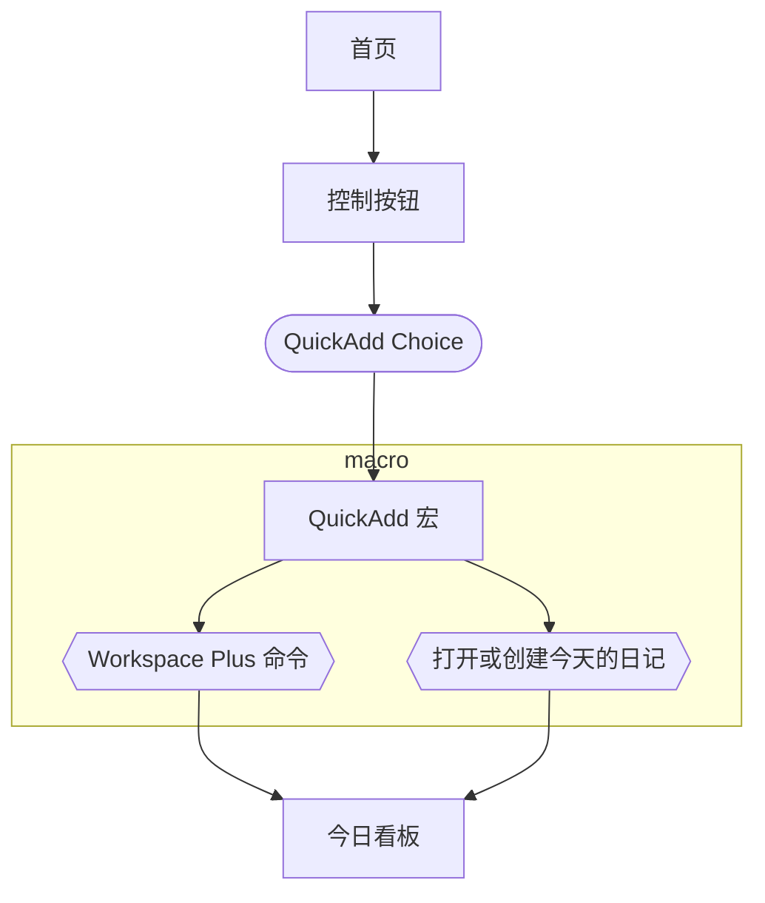

#### 01 用 OB 读书

- 通过写作输出
- 给书中的摘录“打标签”，以这种标签命名文档名建立不同的文档
例如：
	关于坏习惯 
	关于目标

相当于事先准备好的“头脑风暴”
- 在写作页面添加引用，通过链接关联起读书笔记里的内容

#### 08 生成关系图谱动画

`Ctrl+P` 打开命令行输入“生长”+`Enter`

#### 09 用 OB 学习唐诗三百首

本期演示的 OB 库的下载链接： https://share.weiyun.com/VvmFnmgV
配合 Airtable
**文本合并公式 `CONCATENATE()`**


注意：从 Airtable 复制出去的文本带有引号，可以通过查找替换去掉
插件：Note Refactor
打开关系图谱筛选对应开关，可以按照添加好的 tag 去学习对应的诗歌
弹幕：以关键词为筛选条件，可以玩飞花令
根据自己需求、喜好添加内容

#### 10 文本的进一步处理，以唐诗三百首为例

OB 链接形式：双方括号 `[[]]`，需要预览（嵌入）只需在前面加入 `!`
预览到的内容里的标签点击后依然可以自动搜索所有含有此标签的内容，而该标签本身不会包含在预览页面所在的文档中。
嵌入起始位置可以设置：`#` 链接到标题，`^` 到具体的文本块（会随机生成块序列），`|` 到行
批量嵌入如何做？
**使用电子表格合并不同文本，在公式里添加的文本需要用英文引号 `""` 包起来，再粘贴到 OB 中**
快捷键：不带格式粘贴 `Ctrl+Shift+V`
工具推荐：网址 mytexttools.com

#### 19 OB 的强大搜索功能

搜索栏附近的设置及提示：
1. 匹配大小写
2. 解释搜索语句
3. 折叠或者展开搜索结果
4. 显示周边信息
5. 排序
6. **复制搜索结果**：便于复制后建立新的文档

**搜索语法**：
- 空格相当于 and
- 或者 OR
- 英文双引号 `""` 会搜索包含引号内内容的结果
- 英文小括号 `()` 组合语句
- 转移符号 `\` 改变运算符的含义，查找该运算符文本本身
- 支持正则表达式

**搜索符的使用**
默认的几个（略）
理解 content, section, block, line, etc.
checklist（任务列表）可以使用 task（还可细分是否完成）搜索

```
- [] task-todo
- [x] task-done
```

搜索历史
收藏搜索记录 核心插件 - 星标，即收藏功能
在笔记中嵌入搜索记录（query 语句）

```
```query
此处输入要搜索的内容
```

#### 26 关于模板、标签、别名、嵌入、frontmatter 和快捷键

模板：可以是结构，也可以是内容（含语句），像是乐高里的积木块
例如：将嵌入网页的代码作为模板 (根据需要替换网址即可)

```
<iframe src="https://ob.pory.app" width="100%" height="600px"></iframe>
```

编程里的 DRY 原则：Don't Repeat Yourself.
给插入模板设置快捷键，推荐 `Ctrl+Cmd+T`
加标签的方法
1. 导出后会显示在正文当中的 `#标签`
2. 写在 frontmatter 里的 tags，v1.5.3 中已成为文档属性（别名 Aliases 也可以是一种文档属性）
**重要提醒：有需要再去找插件！**

#### 29 Markdown 入门技巧 - 标题和列表

基本语法略
关于标题：
插件：
Number Headings：实现给不同层级标题加入序号，如 1, 1.1, 1.1.1 等
Shortcuts extender：实现用快捷键更改标题的层级
List 层级的变换，增加缩进 `Tab` 键；减少缩进 `Shift+Tab` 键
Checklist 除了在预览模式下点击勾选外，在编辑模式下的快捷键是 `Cmd+Enter`
列表里不同行顺序的调整可以在快捷键中设置，如 `Cmd+↑`，`Cmd+↓`

#### 37 在 OB 中使用 Mermaid 制作流程图

弹幕：OB 自带，事实上大部分 md 都支持用代码块直接输入 mermaid
评论区
> 类似写代码逻辑先定义参数，然后进行参数逻辑运算 *@总被回忆调戏*
> > 没错，更准确的说，先定义变量🤣 *@Johnny 学*

Johnny 展示的示例

