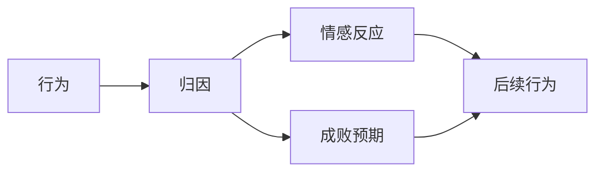

## 8.1 学习动机概述

### 8.1.1 学习动机

动机（motivation）：激发、引导、维持并使行为指向特定目的的一种力量。
学习动机（motivation to learn）：引起和维持学生学习活动，并将该学习互动引向一定学习目标的动力倾向。
学习动机的作用：
1. 引发作用（相对强度）
2. 定向作用（方向或目标）
3. 维持作用（持续性）

衡量学习动机：
1. 选择行为
2. 在达成目标的过程中所付出的努力
3. 采取某种行为的频率
4. 追求目标的坚持性

学习动机的相关概念
**兴趣**（interests）：指一个人经常趋向于认识、掌握某种事物，力求参与某项活动，并且有积极情绪色彩的心理倾向。
- 个体兴趣（Individual interest）：源于具体的知识、信念或价值观的兴趣（Renninger, 1992）
- 情境兴趣（situational interest）：由任务本身所引发的兴趣（Hidi & Anderson, 1992; Reeve, 1996）

个体兴趣与情境兴趣的关系密不可分：
- 个体兴趣的产生与发展离不开情境兴趣
- 个体兴趣也会影响情境兴趣的产生
- 人格特质 vs 基本的情绪体验

**价值观**
三种价值（Eccels, et al., 1983）
- 成就价值（attainment value）：个体在任务中表现良好的重要性，与个体的需要及取得成功的意义相关；
- 内在价值或兴趣价值（intrinsic or interest value）：个体从活动本身获得乐趣
- 效应价值（utility value）：帮助个体达到一个短期或者长期目标价值

代价（cost）：构成任务价值的关键因素，是对个体选择和完成某种任务的消极影响因素

### 8.1.2 内部动机和外部动机

- **内部动机**（intrinsic motivation）：因学习活动本身的意义和价值所引起的动机（Pintrich & Schunk, 1996）
- **外部动机**（extrinsic motivation）：因学习活动的外部后果而引起的动机（Pintrich & Schunk, 1996）

探究内部动机与外部动机关系的实验：德西效应（Westermers Effect）实验
该实验说明：
- 外部动机使用不当会削弱内部动机；
- 学习动机不等于内部动机 + 外部动机这样的简单相加的关系

自我决定理论（self-determinism theory）的观点（Deci & Ryan, 1985）：两种动机是一个连续体的两端

外部动机可以转化为内部动机，如“干一行爱一行”

### 8.1.3 耶克斯 - 多德森定律

耶克斯 - 多德森定律（Yerkes-Dodson law）
动机水平与效率水平之间的关系：动物实验
- 动机 - 效率呈倒 U 型曲线
- 不同动机水平下的最佳效率不是固定的，依据任务的不同性质会有所改变

注意：任务难度对每个人来说是有差异的。

启发：
- 学会根据任务性质调整自己动机会有利于取得好成绩
	- 需要做到：
		- 准确评价任务的难度。任务难度过大时，往往带来焦虑情绪，导致注意力分散、记忆力下降、思维迟钝等
		- 确定合理的目标和期望

练习：学习动机的作用包括（）
正确答案：引发，定向，维持，调节均属于动机的作用。

## 8.2 学习动机理论

### 8.2.1 需要层次理论

马斯洛：人的所有行为都是有意义的，都有其特殊的目标，这种目标来源于我们的需要。

人有 7 种基本需要：
1. 生理需要
2. 安全需要
3. 归属与爱的需要
4. 尊重的需要
5. 求知与理解的需要
6. 审美的需要
7. 自我实现的需要——成就一个人有能力成就的一切的需要

启示：
1. 将学生作为一个整体的“人”来对待，理解其生理需要、情感需要和治理需要是相互关联的；
	- 如学校免费早餐、午餐计划；预防和治理校园治理；关注学生家庭状况；注重班级氛围的建设
2. 在学校中，最重要的缺失需要是爱和尊重

### 8.2.2 自我决定理论

自我决定理论（self-determination theory），德西和瑞安
该理论的基本假设：
- 人是积极自主的有机体，具有与生俱来的心理成长倾向，会努力地应对环境中的持续挑战，并将外部经验整合到自我概念中；
- 这种内在的心理成长倾向需要社会环境的滋养，即满足三种基本心理需要（**自主、能力、关系**），才能有效地发挥出来；
	- 自主（autonomy）需要：按照自己的意愿去选择和行动的需要；
	- 能力（competence）需要/胜任需要：感到自己有能力应对外界环境要求的需要；
	- 关系（relatedness）需要：与他人建立安全、信任的人际关系的需要。

注意：自我决定理论中的三种基本心理需要没有先后之分。

启示：师生关系、同伴关系的优劣会影响学生的学业发展与心里幸福感。

如何满足学生的基本心理需要：
1. 引导学生树立内部目标；
2. 设置适度挑战任务；
3. 提供自主性支持；
4. 呈现信息性的指导、规则、反馈、评价和奖励；
5. 营造和谐的人际关系氛围。

### 8.2.3 成就动机理论

默里提出，麦克里兰、阿特金森发展
成就动机（achievement motivation）：追求卓越、力求获得成功的动机；成就动机可分为追求成功的倾向 vs 避免失败的倾向

成就动机的期望——价值理论
影响两种倾向的要素

| **追求成功的倾向** Ts=Ms×Ps×Is                      | **避免失败的倾向** Taf=Maf×Pf×If                         |
| ----------------------------------------------- | ---------------------------------------------------- |
| 1. 成就需要（Ms） 2. 成功的主观估计（Ps） 3. 成功的诱因价值（Is） | 1. 避免失败的需要（Maf） 2.  失败的主观估计（Pf） 3. 失败的诱因价值（If） |

成就动机 T=Ts-Taf

注意：
- 成功的主观估计和成功的诱因价值具有此消彼长的关系；
- 当成可能性为中等的时候，力求成功的动机最强。

### 8.2.4 自我效能感理论

**自我效能（self-efficacy）感**，阿尔伯特·班杜拉
- 人们对自己能否成功地从事某一具体活动的主观判断。

自我效能感 vs 自信、自尊
- 与自信不同，自我效能感具有情景特定性；
- 与自尊不同，自尊是个体对自我价值的判断

自我效能感的作用：
- 影响选择与**行为**：人们倾向于选择并坚持自认为能胜任的任务
- 影响**认知**：高自我效能感的人视任务为挑战，低自我效能感的人视任务为威胁
- 影响**动机**：影响个体参与活动的积极性
- 影响**情感**、情绪体验：高自我效能感的人往往能够承受压力、情绪饱满、轻松

自我效能感的影响因素：
1. 直接经验
2. 替代经验
3. 言语说服
4. 情绪唤醒

提升自我效能感的措施：
1. 为学生提供难度适宜的学习任务，让学生多一些成功体验；
2. 给学生树立可模仿的榜样；
3. 鼓励学生，给予学生积极反馈；
4. 指导学生进行有效的情绪调节等。

### 8.2.5 成就目标理论

能力内隐观（implicit theories of ability），德维克
- 能力增长观，即能力是可改变的，可以随着知识的增长、技能的训练而提高；
- 能力实体观，即能力是先天的、固定的，不可改变的；

成就目标（achievement goals）：个体对从事学业成就任务的目的或原因的认识

两种能力观点追求不同的目标类型：

| 能力增长观                                                    | 能力实体观                                                             |
| -------------------------------------------------------- | ----------------------------------------------------------------- |
| 掌握目标（mastery goals）                                      | 表现目标（performance goals）                                           |
| - 致力于掌握知识和技能 - 采取自我惨重，寻求并迎接挑战，运用积极、有效的策略 - 任务卷入学习者 | - 致力于显示或证明能力或避免显得无能 - 关注成绩和他人评价，维护自我形成，采取防御性的消极策略 - 自我卷入学习者 |

表现目标的进一步分类
- 表现 - 趋近目标：着眼于展现能力，做到比别人优秀；
- 表现 - 回避目标：着眼于避免表现差劲，避免跟别人相比显得无能

社会目标

互动题：你追求何种目标？若你的学业目标与社会目标冲突时，你会怎么办？

### 8.2.6 归因理论

代表人物 韦纳
归因（attribution）：对自己或他人的行为及其结果的原因加以解释和推测的过程。

归因的维度：
1. 控制点——内部原因 or 外部原因
2. 稳定性——原因是否具有跨时间、跨情境的稳定性
3. 可控性——原因自身是否可控

（**？**）注意：归因理论认为能力是一种稳定且不可控因素；能力增长观认为能力不稳定且可控

归因的作用：
- 控制点
	- 将成功归因于内部会带来积极情绪体验，归因于外部会产生侥幸心理；
	- 将失败归因于内部会带来消极情绪体验，归因于外部会感到生气、不公
- 稳定性
	- 将成功归因于稳定因素，将期望未来再度成功；
	- 将失败归因于稳定因素，将预期再度失败，产生消极情绪，倾向于放弃
- 可控性
	- 将成功归因于可控因素，即认为成功是自己的功劳，会感到自豪；
	- 将失败归于可控因素，即认为失败的责任在自己，会感到愧疚；归于不可控因素，则倾向于不作为

对成败的归因以及由归因引起的情绪反应和未来成败预期对个体随后的行为具有动力作用：

- 将失败归因于稳定、不可控的因素会导致动机严重受损，听天由命、沮丧无助（习得性无助）

启示：教师不仅要引导学生进行积极、准确而具体的归因，还要注意自身反馈对学生的归因的影响。

### 8.2.7 自我价值理论

科温顿
自我价值（self-worth）理论：自我接纳是人的最优先追求，而人因自我价值而接纳自我。
学生头脑中的观念：能力→成功→自我价值 $\Rightarrow$ 能力=成功=自我价值，被他人视作有能力的人就成为学生的首要需求。

- 个体具有维护自尊和自我价值的需要
	- 采取防御策略，如拖延、回避学习任务、贬低任务重要性、设置虚高目标→切断失败和能力的关联
- 这种保护和防御，以建立一个正面自我形象的倾向，就是自我价值动机

启示：
- 努力对学生而言是一把双刃剑——获得成功和嘉奖 vs 威胁自我价值
- 要解决上述困境，必须打破学生头脑中不合理的归因链条

措施：
1. 尽量减少学习过程中不必要的学生间竞争，采取基于学生自我比较而非他人比较的评价方式；
2. 引导学生树立成长型思维，正确认识努力与错误的价值；
3. 不以学业成绩优劣评价学生能力，尊重学生的多元能力发展；
4. 通过设置合理任务，让学生在多个方面体验成功，形成积极的自我效能感，进而建立自我价值感。