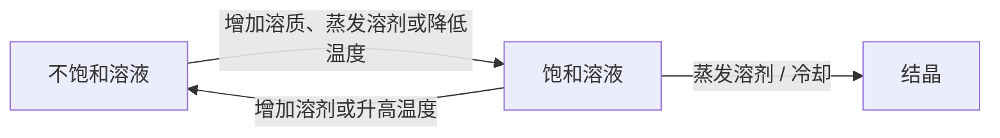

## 参考资料

- [义务教育教科书·化学九年级下册](https://basic.smartedu.cn/tchMaterial/detail?contentType=assets_document&contentId=1998204c-f017-4f49-9000-0ba0b93d2a4d&catalogType=tchMaterial&subCatalog=tchMaterial)

## 第八单元 金属和金属材料 1

### 课题 1 金属材料 2

常见金属的物理性质
金属之最
合金，常见合金的主要成分、性能和用途
淬火、回火

### 课题 2 金属的化学性质 9

金属与氧气的反应
$$\rm 4Al+3O_2\xlongequal{\ \ \ }2Al_2O_3 $$
金属与盐酸、稀硫酸的反应

**置换反应**
常见金属在溶液中的活动性顺序

### 课题 3 金属资源的利用和保护 14

铁的冶炼
$$\rm Fe_2O_3+3CO\xlongequal{高温}2Fe+3CO_2$$

杂质，铁制品锈蚀
保护金属资源：防腐蚀、回收利用、合理开采、寻找金属的代用品
稀土

实验活动 4 金属的物理性质和某些化学性质 24

## 第九单元 溶液 25

### 课题 1 溶液的形成 26

溶液，溶剂，溶质，溶解性
乳浊液，乳化，悬浊液

### 课题 2 溶解度 33

饱和溶液，不饱和溶液，结晶

海水晒盐的大致过程

固体的溶解度，溶解度的相对大小，溶解度曲线，气体的溶解度

### 课题 3 溶液的浓度 42

溶质的质量分数
$$溶质的质量分数=\frac{溶质质量}{溶液质量}\times 100\%$$
体积分数

实验活动 5 一定溶质质量分数的氯化钠溶液的配制 47

## 第十单元 酸和碱 49

### 课题 1 常见的酸和碱 50

酸，碱，酸碱指示剂
- $\rm 酸\longrightarrow H^++酸根离子$
- $\rm 碱\longrightarrow 金属离子OH^-$
常见的酸：盐酸，硫酸，硝酸（$\rm HNO_3$），醋酸（$\rm CH_3COOH$）
脱水作用，浓硫酸稀释的正确操作
酸的化学性质
$$\rm Fe_2O_3+6HCl\xlongequal{\ \ \ }2FeCl_3+3H_2O$$
$$\rm Fe_2O_3+3H_2SO_4\xlongequal{\ \ \ }Fe_2(SO_4)_3+3H_2O$$
常见的碱：氢氧化钠（俗名 苛性钠、火碱或烧碱），氢氧化钙（俗称熟石灰或消石灰），氢氧化钾（$\rm KOH$），氨水（$\rm NH_3\cdot H_2O$）
潮解
$$\rm CaO+H_2O\xlongequal{\ \ \ }Ca(OH)_2$$
碱的化学性质
$$\rm 2NaOH+CO_2\xlongequal{\ \ \ }Na_2CO_3+H_2O$$

### 课题 2 酸和碱的中和反应 60

$$\rm NaOH+HCl\xlongequal{\ \ \ }NaCl+H_2O$$
$$\rm Ca(OH)_2+2HCl\xlongequal{\ \ \ }CaCl_2+2H_2O$$
$$\rm 2NaOH+H_2SO_4\xlongequal{\ \ \ }Na_2SO_4+2H_2O$$
盐
中和反应在实际中的应用
酸碱度 pH

实验活动 6 酸、碱的化学性质 69
实验活动 7 溶液酸碱性的检验 70

## 第十一单元 盐 化肥 71

课题 1 生活中常见的盐 72
氯化钠、碳酸钠、碳酸氢钠、碳酸钙
碳酸钙与盐酸反应
![[教材通读课-人教版化学（9上）#^46012a]]

碳酸钠、碳酸氢钠与盐酸反应
$$\rm Na_2CO_3+2HCl\xlongequal{\ \ \ }2NaCl+CO_2\uparrow+H_2O$$
$$\rm NaHCO_3+HCl\xlongequal{\ \ \ }NaCl+CO_2\uparrow+H_2O$$
碳酸钠与氢氧化钙
$$\rm Na_2CO_3+Ca(OH)_2\xlongequal{\ \ \ }CaCO_3\downarrow+2NaOH$$
复分解反应，复分解反应发生的条件

P76 化学物质的分类，树状分类法
P77 石笋和钟乳石的形成
$$\rm CaCO_3+CO_2+H_2O\xlongequal{\ \ \ }Ca(HCO_3)_2$$
$$\rm Ca(HCO_3)_2\xlongequal{\ \ \ }CaCO_3\downarrow+CO_2\uparrow+H_2O$$
盐的分类和称呼

课题 2 化学肥料 79
化学肥料，化学农药 [^1]，复合肥料
P83 化肥的简易鉴别

实验活动 8 粗盐中难溶性杂质的去除 87

## 第十二单元 化学与生活 89

课题 1 人类重要的营养物质 90
六大营养素及其主要营养功能 [^2]
$$\rm C_6H_{12}O_6+6O_2\xlongequal{酶}6CO_2+6H_2O$$

### 课题 2 化学元素与人体健康 97

常量元素，微量元素
几种必须微量元素对人体的作用

几种微量元素的主要食物来源

| 元素种类 | 主要食物来源            |
| ---- | ----------------- |
| 铁    | 肝、瘦肉、蛋、鱼、豆类、芹菜    |
| 锌    | 海产品、瘦肉、肝、奶类、豆类、小米 |
| 碘    | 海产品、加碘盐           |

### 课题 3 有机合成材料 102

无机化合物，有机化合物（简称 有机物），有机高分子（化合物）/ 聚合物，合成有机高分子材料（简称 合成材料）
热塑性，热固性
酚醛塑料，俗称电木；脲醛塑料，俗称电玉
合成纤维
降解
复合材料

## 专业术语中英对照表

| **中文**  | **英文**                        |
| ------- | ----------------------------- |
| 金属      | metal                         |
| 铁       | iron                          |
| 铜       | copper                        |
| 铝       | aluminium                     |
| 钢       | steel                         |
| 钛       | titanium                      |
| 合金      | alloy                         |
| 置换反应    | displacement reaction         |
| 金属活动性顺序 | metal activity series         |
| 溶剂      | solvent                       |
| 溶质      | solute                        |
| 溶液      | solution                      |
| 饱和溶液    | saturated solution            |
| 不饱和溶液   | unsaturated solution          |
| 溶解度     | solubility                    |
| 氯化钠     | sodium chloride               |
| 硝酸钾     | potassium nitrate             |
| 结晶      | crystallization               |
| 浓度      | concentration                 |
| 溶质的质量分数 | mass fraction of solute       |
| 酸       | acid                          |
| 碱       | base                          |
| 酚酞      | phenolphthalein               |
| 石蕊      | litmus                        |
| 酸碱指示剂   | acid-base indicator           |
| 盐酸      | hydrochloric acid             |
| 硫酸      | sulfuric acid                 |
| 硝酸      | nitric acid                   |
| 氢氧化钠    | sodium hydroxide              |
| 氢氧化钙    | calcium hydroxide             |
| 潮解      | deliquescence                 |
| 中和反应    | neutralization reaction       |
| 盐       | salt                          |
| 碳酸钠     | sodium carbonate              |
| 碳酸氢钠    | sodium bicarbonate            |
| 复分解反应   | double decomposition reaction |
| 化学肥料    | chemical fertilizer           |
| 农药      | agricultural chemicals        |
| 蛋白质     | protein                       |
| 氨基酸     | amino acid                    |
| 酶       | enzyme                        |
| 糖类      | carbohydrate                  |
| 葡萄糖     | glucose                       |
| 蔗糖      | sucrose                       |
| 淀粉      | starch                        |
| 有机化合物   | organic compound              |
| 合成材料    | synthetic material            |
| 高分子化合物  | polymer                       |
| 塑料      | plastic                       |
| 合成纤维    | synthetic fiber               |
| 合成橡胶    | synthetic rubber              |

[^1]: 推荐一本书 [《寂静的春天》](https://book.douban.com/subject/35232618/)
[^2]: 联系生物课上学习的知识