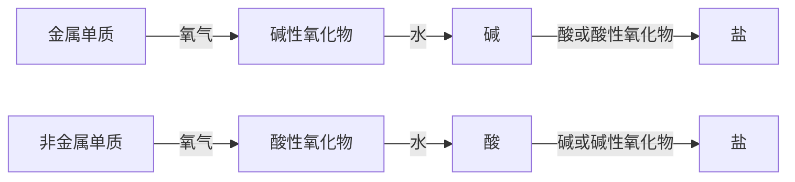

## 参考资料

- [普通高中教科书·化学必修 第一册](https://basic.smartedu.cn/tchMaterial/detail?contentType=assets_document&contentId=5cd19072-e40d-4a73-8580-7b7ada5d4005&catalogType=tchMaterial&subCatalog=tchMaterial)

P4 高中化学理论主要包括有关物质变化和物质结构的原理，前者涉及化学反应类型如离子反应、氧化还原反应、取代反应、加成反应等）、化学反应与能量变化、化学反应速率、化学平衡，等等；后者包括原子结构、元素周期表和周期律、化学键和分子结构，等等

## 第一章 物质及其变化 5

### 第一节 物质的分类及转化 6

同素异形体（allotrope）
树状分类法，交叉分类法
酸性氧化物（acidic oxide），碱性氧化物（basic oxide）
分散系（dispersion system），分散质，分散剂
溶液，乳浊液，悬浊液，胶体（colloid），液溶胶，气溶胶，固溶胶
丁达尔效应
单质到盐的一种转化关系：

### 第二节 离子反应 14

电解质（electrolyte），熔融状态，电离（ionization），水合离子，电离方程式

>[!note] 酸碱盐的定义
>酸：电离时生成的阳离子全部都是氢离子的化合物，叫酸
>碱：电离时生成的阴离子全部都是氢氧根离子的化合物，叫碱  
>盐：酸根离子与金属离子的化合物，叫盐

方法引导：模型

离子反应（ionic reaction），离子方程式（ionic equation）
例如：化学反应 $\ce{Na2SO4 + BaCl2 \xlongequal{} 2NaCl + BaSO4\downarrow}$ 的实质：
$$\ce{Ba^2+ +SO^2-_4\xlongequal{}BaSO4\downarrow}$$
强酸与强碱中和反应的实质
$$\ce{H+ + OH- = H2O}$$
Zn 与稀硫酸反应的离子方程式 $\ce{Zn + 2H+ = Zn^2+ + H2\uparrow}$

### 第三节 氧化还原反应 22

氧化还原反应（oxidation-reduction reaction）
重要特征：反应前后一定存在电子转移（电子得失/共用电子对偏移）有元素的化合价发生变化

还原剂（reductant），氧化剂（oxidant）

P26 催化转化器

## 第二章 海水中的重要元素——钠和氯 33

### 第一节 钠及其化合物 34

钠（sodium）
$$\ce{4Na + O2 = 2Na2O}$$
$$\ce{2Na + O2 \xlongequal\triangle 2Na2O2}$$
$$\ce{2Na + 2H2O = 2NaOH + H2\uparrow}$$
钠的几种化合物
- 氧化钠和过氧化钠
$$\ce{2Na2O2 + 2H2O = 4NaOH + O2\uparrow}$$
$$\ce{2Na2O2 + 2CO2 = 2Na2CO3 + O2}$$
- 碳酸钠和碳酸氢钠
碳酸钠晶体——水合碳酸钠（$\ce{Na2CO3\cdot xH2O}$）
$$\ce{2NaHCO3 \xlongequal\triangle Na2CO3 + H2O + CO2\uparrow}$$
焰色试验（flame test）

一些金属元素的焰色

| 金属元素 | 锂   | 钠   | 钾   | 铷   | 钙   | 锶   | 钡   | 铜   |
| ---- | --- | --- | --- | --- | --- | --- | --- | --- |
| 焰色   | 紫红色 | 黄色  | 紫色  | 紫色  | 砖红色 | 洋红色 | 黄绿色 | 绿色  |

研究与实践：了解纯碱的历史
- 布兰制碱法
- 索尔维制碱法
- 侯氏制碱法

### 第二节 氯及其化合物 44

氯气（chlorine）
1. 与金属、非金属单质的反应
$$
\begin{gather}
\ce{2Na + Cl2 \xlongequal\triangle 2NaCl}\\
\ce{2Fe + 3Cl2 \xlongequal\triangle 2FeCl3}\\
\ce{Cu + Cl2 \xlongequal\triangle CuCl2}\\
\\
\ce{H2 + Cl2 \xlongequal{点燃} 2HCl}\\
\end{gather}
$$
2. 与水的反应
$$\ce{Cl2 + H2O <=> HCl + HClO}$$
次氯酸易分解
$$\ce{2HClO \xlongequal{光照} 2HCl + O2\uparrow}$$
3. 与碱的反应
$$
\begin{gather}
\ce{Cl2 + 2NaOH \xlongequal{\ \ } NaCl + NaClO +H2O}\\
\ce{2Cl2 + 2Ca(OH)2 \xlongequal{\ \ }  Ca(ClO)2 + CaCl2 + 2H2O}\\
\end{gather}
$$
氯气的实验室制法
$$\ce{MnO2 + 4HCl(浓) \xlongequal\triangle MnCl2 + Cl2\uparrow + 2H2O}$$

装置的连接顺序一般为：发生装置→除杂装置（如需要）→收集装置→尾气处理装置（如需要）

氯离子的检验
- 使用稀盐酸 / $\ce{NaCl}$ 溶液
$$\ce{Cl- + Ag+ = AgCl\downarrow}$$
- 使用 $\ce{Na2CO3}$ 溶液
$$\ce{CO^2-_3 + 2Ag+ = Ag2CO3\downarrow}$$
$\ce{Ag2CO3}$ 可溶于稀硝酸
$$\ce{Ag2CO3 + 2H+ = 2Ag+ + CO2\uparrow + H2O}$$
可见，检测需要排除干扰

### 第三节 物质的量 53

物质的量（amount of substance） ，摩尔（mole）
物质的量、阿伏加德罗常数（$N_A=6.02\times 10^{23}\  \rm mol^{-1}$）与粒子数（$N$）之间的关系
$$n=\frac{N}{N_A}$$
国际单位制（SI）的 7 个基本单位

| **物理量** | **单位名称** | **单位符号** |
|---------|----------|----------|
| 长度      | 米        | m        |
| 质量      | 千克（公斤）   | kg       |
| 时间      | 秒        | s        |
| 电流      | 安［培］     | A        |
| 热力学温度   | 开［尔文］    | K        |
| 物质的量    | 摩［尔］     | mol      |
| 发光强度    | 坎［德拉］    | cd       |

摩尔质量（molar mass）
物质的量，物质的质量和摩尔质量（$M$）之间的关系
$$n=\frac{m}{M}$$

气体摩尔体积（molar volume of gas）
$$V_m=\frac{V}{n}$$
B 物质的量浓度（amount-of-substance concentration of B）
$$c_B=\frac{n_B}{V}$$
容量瓶的使用
稀释溶液是常用的计算式
$$c(浓溶液)\cdot V(浓溶液)=c(稀溶液)\cdot V(稀溶液)$$

### 实验活动 1 配制一定物质的量浓度的溶液 65

## 第三章 铁 金属材料 67

### 第一节 铁及其化合物 68

铁（iron）
$$\ce{3Fe + 4H2O(g)\xlongequal{高温}Fe3O4 + 4H2}$$
铁的重要化合物
1. 铁的氧化物
$$
\begin{gather}
\ce{FeO + 2H+ = Fe^2+ + H2O}\\
\ce{Fe2O3 + 6H+ = 2Fe^3+ + 3H2O}\\
\end{gather}
$$
2. 铁的氢氧化物
氢氧化铁（iron( III ) hydroxide），氢氧化亚铁（iron( II ) hydroxide）
$$
\begin{gather}
\ce{FeSO4 + 2NaOH = Fe(OH)2\downarrow + Na2SO4}\\
\\
\ce{4Fe(OH)2 + O2 + 2H2O = 4Fe(OH)3}\\
\\
\ce{2Fe(OH)3 \xlongequal\triangle Fe2O3 + 3H2O}
\end{gather}
$$
3. 铁盐和亚铁盐
$$\ce{2Fe^3+ + Fe = 3Fe^2+}$$
$$\ce{2Fe^2+ + Cl2 = 2Fe^3+ + 2Cl-}$$
P74 利用覆铜板制作印刷电路板

### 第二节 金属材料 78

合金的优点
铁合金，碳素钢，合金钢（特种钢）
高碳钢，中碳钢，低碳钢

钢中合金元素的主要作用

| **合金元素** | **主要作用**                     |
|----------|------------------------------|
| 铬（Cr）    | 增强耐磨性和抗氧化性；增强高温强度；提高高碳钢的耐磨性等 |
| 锰（Mn）    | 防止硫引起的脆性；增强钢的强度和韧性等          |
| 钼（Mo）    | 降低脆性；增强高温强度；提高红热时的硬度和耐磨性等    |
| 钨（W）     | 提高高温时的强度和硬度；增强工具钢的耐磨性等       |
| 钴（Co）    | 提高红热时的硬度和耐磨性；用于制造磁性合金等       |
| 镍（Ni）    | 增强低温时的韧性；改变高铬钢的内部结构等         |
| 硅（Si）    | 提高低合金钢的强度和硬度；增强高温时的抗氧化性等     |

铝
$$\ce{Al2O3 + 6HCl = 2AlCl3 + 3H2O}$$
$$\ce{2Al + 6HCl = 2AlCl3 + 3H2\uparrow}$$
$$\ce{2Al + 2NaOH + 6H2O = 2Na[Al(OH)4] + 3H2\uparrow}$$
$$\ce{Al2O3 + 2NaOH + 3H2O = 2Na[Al(OH)4]}$$
四羟基合铝酸钠
铝合金，硬铝

新型合金，储氢合金，钛合金，耐热合金，形状记忆合金

物质的量在化学方程式计算中的应用
化学方程式中各物质的化学计量数之比等于各物质的物质的量之比

### 实验活动 2 铁及其化合物的性质 90

## 第四章 物质结构 元素周期律 91

### 第一节 原子结构与元素周期表 92

元素周期表（periodic table of elements）
原子结构

$质量数 (A) ＝ 质子数 (Z) + 中子数 (N)$
原子序数（atomic number），周期（period），族（group），碱金属元素，卤族元素
核素（nuclide），同位素（isotope）

原子结构与元素的性质
金属性，非金属性
1. 碱金属元素
2. 卤族元素（简称卤素）

P101 方法引导：预测

### 第二节 元素周期律 107

元素周期律（periodic law of elements）

元素的化合价与元素在周期表中的位置的关系

### 第三节 化学键 113

离子键（ionic bond），电子式，结构式，共价键（covalent bond），极性共价键（简称极性键），化学键（chemical bond）

分子间作用力（范德华力），氢键

### 实验活动 3 同周期、同主族元素性质的递变 122

## 一些常见元素中英文名称对照表 128

| **元素符号** | **中文**  | **英文**     | **元素符号** | **中文**  | **英文**    |
| -------- | ------- | ---------- | -------- | ------- | --------- |
| Ag       | 银（yín）  | silver     | Al       | 铝（lǚ）   | aluminum  |
| Ar       | 氩（yà）   | argon      | Au       | 金（jīn）  | gold      |
| B        | 硼（péng） | boron      | Ba       | 钡（bèi）  | barium    |
| Be       | 铍（pí）   | beryllium  | Br       | 溴（xiù）  | bromine   |
| C        | 碳（tàn）  | carbon     | Ca       | 钙（gài）  | calcium   |
| Cl       | 氯（lǜ）   | chlorine   | Co       | 钴（gǔ）   | cobalt    |
| Cr       | 铬（gè）   | chromium   | Cu       | 铜（tóng） | copper    |
| F        | 氟（fú）   | fluorine   | Fe       | 铁（tiě）  | iron      |
| Ga       | 镓（jiā）  | gallium    | Ge       | 锗（zhě）  | germanium |
| H        | 氢（qīng） | hydrogen   | He       | 氦（hài）  | helium    |
| Hg       | 汞（gǒng） | mercury    | I        | 碘（diǎn） | iodine    |
| K        | 钾（jiǎ）  | potassium  | Kr       | 氪（kè）   | krypton   |
| Li       | 锂（lǐ）   | lithium    | Mg       | 镁（měi）  | magnesium |
| Mn       | 锰（měng） | manganese  | N        | 氮（dàn）  | nitrogen  |
| Na       | 钠（nà）   | sodium     | Ne       | 氖（nǎi）  | neon      |
| Ni       | 镍（niè）  | nickel     | O        | 氧（yǎng） | oxygen    |
| P        | 磷（lín）  | phosphorus | Pb       | 铅（qiān） | lead      |
| Pt       | 铂（bó）   | platinum   | Ra       | 镭（léi）  | radium    |
| Rn       | 氡（dōng） | radon      | S        | 硫（liú）  | sulphur   |
| Sc       | 钪（kàng） | scandium   | Se       | 硒（xī）   | selenium  |
| Si       | 硅（guī）  | silicon    | Sn       | 锡（xī）   | tin       |
| Sr       | 锶（sī）   | strontium  | Ti       | 钛（tài）  | titanium  |
| U        | 铀（yóu）  | uranium    | V        | 钒（fán）  | vanadium  |
| W        | 钨（wū）   | tungsten   | Xe       | 氙（xiān） | xenon     |
| Zn       | 锌（xīn）  | zinc       |          |         |           |

^5c8b0c

