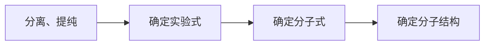

## 参考资料

- [普通高中教科书·化学选择性必修3 有机化学基础](https://basic.smartedu.cn/tchMaterial/detail?contentType=assets_document&contentId=c561d8ee-7c06-4cb1-9a4d-e34036f02d53&catalogType=tchMaterial&subCatalog=tchMaterial)

## 第一章 有机化合物的结构特点与研究方法 3  

### 第一节 有机化合物的结构特点 4  

有机化合物的分类
依据碳骨架分类

依据官能团分类
官能团（functional group）

有机化合物中的共价键
两种基本类型：σ 键和 π 键
共价键的极性与有机反应
有机化合物的同分异构现象
同分异构现象（isomerism），同分异构体（isomer），构造异构，碳架异构，位置异构，官能团异构；立体异构，顺反异构，对映异构
键线式

### 第二节 研究有机化合物的一般方法 13  

研究有机化合物基本步骤

分离（separation），提纯（purification），蒸馏（distillation），萃取（extraction），重结晶（recrystallization），色谱法（chromatography）
元素分析（elemental analysis）
有机化合物分子的实验式（也称最简式）
质谱（mass spectrum, MS），质荷比，红外光谱（infrared spectrum, IR），核磁共振谱（nuclear magnetic resonance spectrum, NMR），X 射线衍射（X ray diffraction, XRD）
化学位移 $\delta$ 
掌握 P24 有机化合物的分类

## 第二章 烃 27  

### 第一节 烷烃 28  

烷烃（alkane），甲烷（methane）
同系物（homolog）
链状烷烃的通式为 $\rm C_nH_{2n+2}$
烷烃的命名，烃基
P31 系统命名法

### 第二节 烯烃 炔烃 34  

烯烃（alkene）$\rm C_nH_{2n}$，乙烯（ethene）
炔烃（alkyne）$\rm C_nH_{2n-2}$，乙炔（ethyne）

乙炔的加成反应

乙炔合成聚乙炔

### 第三节 芳香烃 43  

芳香烃（arene），苯（benzene）

苯的同系物，通式 $\rm C_nH_{2n-6}$
甲苯（toluene）
甲苯与浓硝酸和浓硫酸的混合物在加热条件下发生取代反应生成三硝基取代物的化学方程式

稠环芳香烃

## 第三章 烃的衍生物 53  

### 第一节 卤代烃 54  

卤代烃（halohydrocarbon），溴乙烷
溴乙烷的水解反应

溴乙烷的消去反应（消除反应 elimination reaction）

四氟乙烯加成聚合生成聚四氟乙烯

### 第二节 醇 酚 59  

醇（alcohol），乙醇（ethanol）
一元醇，二元醇，多元醇
乙醇与浓氢溴酸混合加热后发生取代反应

乙醇在浓硫酸的作用下，加热到 170 °C 时生成乙烯

乙醇和浓硫酸的混合物的温度控制在 140 °C 左右，乙醇将以另一种方式脱水生成乙醚

醚（ether）

在有机化学反应中，通常把有机化合物分子中失去氢原子或加入氧原子的反应叫做氧化反应，反之为还原反应。

酚、苯酚（phenol）
石炭酸
苯酚与溴发生取代反应

显色反应

### 第三节 醛 酮 68  

醛（aldehyde），乙醛（acetaldehyde）
乙醛的加成反应
- 催化加氢

- 与氰化氢（HCN）

氧化反应
- 银镜反应（silver mirror reaction）

- 与氢氧化铜 $\rm Cu(OH)_2$ 反应 

- 在一定温度和催化剂存在的条件下被空气中的氧气氧化成乙酸

甲醛（formaldehyde），福尔马林（formalin）
酮（ketone），丙酮
在催化剂存在的条件下，丙酮可以发生催化加氢反应，生成 2- 丙醇

### 第四节 羧酸 羧酸衍生物 73  

羧酸（carboxylic acid），乙酸（acetic acid）
甲酸，苯甲酸，乙二酸（草酸）
乙酸与乙醇的酯化反应（esterification reaction）

酯（ester），乙酸乙酯（ethyl acetate）
酯的水解反应（hydrolysis reaction）

油脂
油脂的水解反应，皂化反应

油脂的氢化反应

胺（amine），苯胺，酰胺（amide）
苯胺与盐酸反应

酰胺的水解反应

### 第五节 有机合成 84  

有机合成（organic synthesis）
主要任务
1. 构建碳骨架
2. 引入官能团

逆合成分析（retrosynthetic analysis  ）

以乙烯为基础原料合成乙二酸二乙酯

掌握 P94 

实验活动 1 乙酸乙酯的制备与性质 98  
实验活动 2 有机化合物中常见官能团的检验 99

## 第四章 生物大分子 101  

联系生物课学习本章内容更轻松

### 第一节 糖类 102  

糖类（saccharide），碳水化合物（carbohydrate），单糖（monosaccharide），葡萄糖（glucose），果糖（fructose）
葡萄糖经酶的催化发生氧化反应放出热量
$$\ce{C6H12O6 + 6O2 ->[酶] 6CO2 + 6H2O}$$
醛糖，酮糖
二糖（disaccharide），蔗糖（sucrose），麦芽糖（maltose）
蔗糖水解生成葡萄糖和果糖
$$\ce{C12H22O11 + H2O ->[酸或酶] C6H12O6 + C6H12O6}$$
麦芽糖水解生成葡萄糖
$$\ce{C12H22O11 + H2O ->[酸或酶] 2C6H12O6}$$
多糖（polysaccharide），淀粉（starch），纤维素（cellulose）
淀粉、纤维素水解生成葡萄糖
$$\ce{(C6H10O5)_n + nH2O ->[酸或酶] nC6H12O6}$$
壳聚糖

### 第二节 蛋白质 112  

氨基酸（amino acid）
氨基酸的两性
成肽反应

肽键（peptide bond），肽（peptide），蛋白质（protein）

蛋白质的性质：水解，盐析，变性
蛋白质的显色反应
酶（enzyme）

### 第三节 核酸 122  

核酸（nucleic acid），核糖核酸（ribonucleic acid, RNA），脱氧核糖核酸（deoxyribonucleic acid, DNA），碱基（base）

聚合酶链反应（polymerase chain reaction, PCR）

实验活动 3 糖类的性质 130  

## 第五章 合成高分子 131  

第一节 合成高分子的基本方法 132  
高分子（macromolecule），单体（monomer），聚合物（polymer）
基本方法：加成聚合反应&缩合聚合反应
加成聚合（addition polymerization），缩合聚合（condensation polymerization），加聚物（addition polymer），缩聚物（condensation polymer）

第二节 高分子材料 136  
高分子材料（polymer materials），
通用高分子材料
- 塑料（plastic）
  - 聚乙烯
  - 酚醛树脂（phenolic resin）
- 合成纤维（synthetic fiber）
  - 聚酯纤维（polyester fiber）
  - 聚酰胺纤维（polyamide fiber）
天然纤维，再生纤维，化学纤维，脂肪族聚酰胺纤维（锦纶），芳香族聚酰胺纤维（芳纶）
- 合成橡胶（synthetic rubber）
功能高分子（functional macromolecule）材料
- 高吸水性树脂（super absorbent resin）
- 高分子分离膜（polymeric separate membrane）

P146 [改性](https://baike.baidu.com/item/%E6%94%B9%E6%80%A7/10683428)
