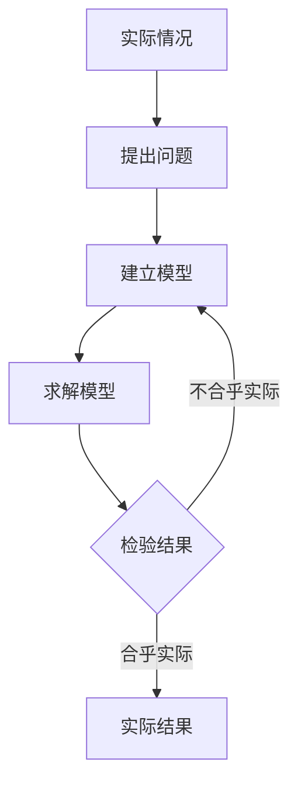

## 参考资料

- [普通高中教科书·数学必修 第一册](https://basic.smartedu.cn/tchMaterial/detail?contentType=assets_document&contentId=b9b57499-3594-4ae3-a33b-4c440739c28a&catalogType=tchMaterial&subCatalog=tchMaterial)

## 第一章 预备知识 1

1 集合（set，简称为集）
元素（element），数集（set of numbers），自然数集 $\rm N$，正整数集 $\rm N_+或\ N^*$，整数集 $\rm Z$，有理数集 $\rm Q$，实数集 $\rm R$，正实数集 $\rm R_+$
列举法，描述法
属于（belong to）$\rm a\in A$，$\rm a\notin A$
空集（empty set） ∅，有限集（finite set），无限集（infinite set）
区间，闭区间 \[a,b]，开区间 (a,b)，半开半闭区间 \[a,b)，(a,b]，区间的端点，无穷大 ∞，集合的数轴表示
子集（subset），Venn 图，真子集（proper subset），

>**规定**：空集是任何集合的子集 ∅

包含于 $\rm A\subseteq B$，真包含于 $\rm A\subsetneqq B$
交集（intersection of sets） $\rm A\cap B$，并集（union of sets）$\rm A\cup B$
全集（universal set），补集（complement of set）$\complement_UA$
P13 集合论，[康托尔](https://baike.baidu.com/item/%E6%A0%BC%E5%A5%A5%E5%B0%94%E6%A0%BC%C2%B7%E5%BA%B7%E6%89%98%E5%B0%94/4614747)

2 常用逻辑用语
推出 $p \Rightarrow q$
必要条件（necessary condition），充分条件（sufficient condition），充要条件（necessary and sufficient condition）
全称量词（universal quantifier）$\forall$，存在量词（existential quantifier）$\exists$，全称量词命题，存在量词命题

>[!note] 全称量词命题和存在量词命题的否定
>$\forall\ x\in M，x\ 具有性质\ p(x). 的否定为\ \exists\ x\in M， x\ 不具有性质\ p(x).$
>$\exists\ x\in M， x\ 具有性质\ p(x). 的否定为\ \forall\ x\in M，x\ 不具有性质\ p(x).$
>

3 不等式
不等式的性质
基本不等式（inequality of arithmetic and geometric means）
$$
\begin{gather}
\frac{a+b}{2} \geq \sqrt{ab}，当且仅当\ a=b\ 时，等号成立 \\
两个非负实数的算数平均值大于或等于他们的几何平均值.
\end{gather}
$$
算数平均值，几何平均值，均值不等式
最小值（minimum），最大值（maximum）

4 一元二次函数与一元二次不等式（quadratic inequality in one variable）

## 第二章 函数 49

1 生活中的变量关系
分段函数（piecewise function）

2 函数（function）
对应关系 $f$，定义域（domain），函数值，值域（range）
函数的表示方法：解析法、列表法、图像法
狄利克雷函数
$$f(x)=\begin{cases}1, & x\ 为有理数, \\ 0, & x\ 为无理数.\end{cases}$$
取整函数

3 函数的单调性和最值
单调递增，单调递增区间，单调递减，单调递减区间，单调性，单调区间
增函数（strictly increasing function），减函数（strictly decreasing function），最大值，最小值，最值

4 函数的奇偶性与简单的幂函数
奇函数（odd function），偶函数 (even function），奇偶性
幂函数（power function）

## 第三章 指数运算与指数函数 75

1 指数幂的拓展

> [!note] 正分数指数幂
>  给定正数 $a$ 和正整数 $m,n（n>1,且m,n互素)$，若存在唯一的正数 $b$，使得 $b^n=a^m$，则称 $b\ 为\ a\ 的\frac{m}{n}次幂$，记作 $b=a^{\frac{m}{n}}$

同理可定义负分数指数幂
$$a^{-\frac{m}{n}}=\frac{1}{a^{\frac{m}{n}}}=\frac{1}{\sqrt[n]{a^m}}$$
扩展到全体实数
$$a^{-a}=\frac{1}{a^a}$$

2 指数幂的运算性质
指数（exponent）
将正数指数幂的运算性质推广到实数
$$
\begin{align}
&(1)\ a^\alpha\cdot a^\beta =a^{\alpha+\beta};\\
&(2)(a^\alpha)^\beta=a^{\alpha \beta};\\
&(3)(ab)^\alpha=a^\alpha b^\alpha.
\end{align}
$$

3 指数函数（exponential function）
指数函数的图像与性质

P88 的**指数函数的图像和性质**表 3-6 是需要自己完全理解的，笔记上不再列出

## 第四章 对数运算与对数函数 97

1 对数的概念
对数（logarithm）$\log_aN=b.$，底数，真数，常用对数（common logarithm） $\lg N$，自然对数（natural logarithm） $\ln N$.

2 对数的运算

若 $\ a>0, 且\ a≠1，M>0, N>0, b\in R$，则对数运算具有如下性质：
$$
\begin{align}\\
&(1)\ \log_a(M\cdot N)=\log_aM+\log_aN;\\
&(2)\ \log_a{\frac{M}{N}}=\log_aM-\log_aN;\\
&(3)\ \log_aM^b=b\log_aM.
\end{align}
$$

>[!note] 换底公式
>一般地，$若a>0, b>0, c>0, 且 a \neq 1, c \neq 1$, 则
>$$\log_ab=\frac{\log_cb}{\log_ca}$$

P109 指数的换底公式
一般地，对于任意不为 1 的正数 $a$ 和 $b$，有 $a=b^{\log_ba}$，所以对任意实数 $\alpha$ 都有 $a^\alpha=b^{\alpha\log_ba}$

3 对数函数（logarithmic function）
常用对数函数，自然对数函数
反函数（inverse function），互为反函数
**对数函数 $y=\log_2x$ 的图像和性质**
P114 **对数函数 $y=\log_ax$ 的图像和性质**

P117 数学软件 GeoGebra [在线使用](https://www.geogebra.org/calculator)

4 指数函数、幂函数、对数函数增长的比较

5 信息技术支持的函数研究

## 第五章 函数应用 129

1 方程解的存在性及方程的近似解
零点（zero），零点存在定理
二分法（bisection method）

2 实际问题中的函数模型

## 第六章 统计 145

1 获取数据的途径
直接获取，直接数据（一手数据），间接获取，间接数据（二手数据）
普查（general survey），抽样调查（sampling survey，抽查）
总体（population），样本（sample），抽样，样本容量，样本量（sample size），总体的分布

2 抽样的基本方法
随机抽样
简单随机抽样（simple random sampling），抽签法，随机数法，随机数表

P156 利用 Excel 产生随机数

分层随机抽样（stratified random sampling）

3 用样本估计总体的分布
直方图（histogram），频率分布直方图，频率折线图

4 用样本估计总体的数字特征
标准差（standard deviation）
$$s=\sqrt{s^2}=\sqrt{\frac{(x_1-\overline x)^2+(x_2-\overline x)^2+\ldots+(x_n-\overline x)^2}{n}}$$
总体平均数（population mean），分层样本合并后的平均值
$$w_1\overline x_1+w_2\overline x_2+\ldots+w_n\overline x_n=\sum_{i=1}^{n}w_i\overline x_i$$
总体方差（population variance）
$$s^2=\sum_{i=1}^{n}w_i[s_i^2+(\overline x_i-\overline x)^2]$$
百分位数（percentile），$p$ 分位数，四分位数

## 第七章 概率 183

1 随机现象与随机事件
确定性现象，随机现象（random phenomenon）
试验，试验结果，列举法
样本空间（sample space），样本点（sample point），有限样本空间
随机事件（random event，简称事件），必然事件（inevitable event），不可能事件（impossible event）
交事件（积事件），并事件（和事件），互斥事件

2 古典概型
概率（probability）
古典概率模型（classical models of probability，古典概型）
$$P(A)=\frac{A包含的样本点个数}{\Omega 包含的样本点总数}=\frac{m}{n}$$
互斥事件的概率加法公式
$$P(A_1\cup A_2\ \cup \ldots\cup A_n)=P(A_1)+P(A_2)+\ldots+P(A_n)$$

3 频率与概率
用频率来估计概率

4 事件的独立性
相互独立事件，相互独立（mutually independent）
$$P(AB)=P(A)P(B)$$

## 第八章 数学建模活动（一）

1 走进数学建模
- 七桥问题，一笔画定理

2 数学建模的主要步骤

3 数学建模活动的主要过程
选题 - 开题 - 做题 - 结题
