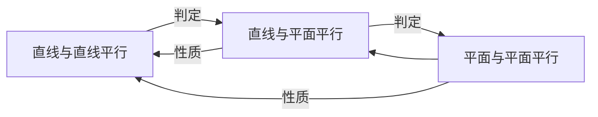

## 参考资料

- [普通高中教科书·数学必修 第二册](https://basic.smartedu.cn/tchMaterial/detail?contentType=assets_document&contentId=4dbbf35b-31dc-4fde-88ba-8369a8999874&catalogType=tchMaterial&subCatalog=tchMaterial)

## 第一章 三角函数 1

1 周期变化
周期函数（periodic function），周期（period），最小正周期
$$f(x+T)=f(x)$$

2 任意角
始边，终边，正角，负角，零角
第几象限角

3 弧度制
单位圆，弧度（radian，符号 rad，常省略），弧度制
弧度与角度的换算
$$\begin{gather} 1°=\frac{2\pi}{360} \rm rad=\frac{\pi}{180}\rm rad≈0.01745\  \rm rad; \\ 1\ \rm rad=\frac{360°}{2\pi}=\frac{180°}{\pi}≈57°18'.\end{gather}$$
圆心角的弧度数等于该角所对的弧长与半径之比：$\alpha=\frac{l}{r}$

### 4 正弦函数和余弦函数的概念及其性质

正弦函数（sine function），余弦函数（cosine function）
设角 $\alpha$ 终边上除原点外的一点 Q(x,y)，则
$$sin\alpha=\frac{y}{r}, \ cos\alpha=\frac{x}{r}$$
其中 $r=\sqrt{x^2+y^2}$

**单位圆与正弦函数、余弦函数的基本性质**
定义域，值域，最值，周期性，单调性，符号

诱导公式 [^1]（induction formula）

诱导公式与旋转

$$
\begin{align}
\sin(-\alpha)&=-\sin \alpha\\
\cos(-\alpha)&=\cos \alpha\\
\\
\sin(\alpha+\pi)&=-\sin \alpha\\
\sin(\alpha-\pi)&=-\sin \alpha\\
\cos(\alpha+\pi)&=-\cos \alpha\\
\cos(\alpha-\pi)&=-\cos \alpha\\
\\
\sin(\pi-\alpha)&=\sin \alpha\\
\cos(\pi-\alpha)&=-\cos \alpha\\

\end{align}
$$
诱导公式与对称

$$
\begin{align}
\sin(\alpha+\frac{\pi}{2})&=\cos \alpha\\
\cos(\alpha+\frac{\pi}{2})&=-\sin \alpha\\
\\
\sin(\alpha-\frac{\pi}{2})&=-\cos \alpha\\
\cos(\alpha-\frac{\pi}{2})&=\sin \alpha\\
\end{align}
$$
诱导公式的一个重要作用是将不是锐角的正弦函数、余弦函数问题转化为锐角的正弦函数、余弦函数问题。

5 正弦函数、余弦函数的图像与性质的再认识
正弦曲线（sine curve），五点（画图）法
余弦曲线（cosine curve）

### 6 函数 $y=Asin(\omega x+\varphi)$ 的性质与图像

- $\omega$ 对 $y=\sin \omega x$ 图像的影响

- $\varphi$ 对 $y=sin(x+\varphi)$ 的影响

- A 对 $y=Asin(\omega x+\varphi)$ 的影响 

### 7 正切函数（tangent function）

正切函数的诱导公式
$$
\begin{align}
\tan(x+k\pi)&=\tan x\ \ \ (k\in \rm Z)\\
\tan(-x)&=-\tan x\\
\tan(\pi-x)&=-\tan x\\
\tan(x+\frac{\pi}{2})&=-\frac{1}{\tan x}\\
\tan(\frac{\pi-x}{2})&=\frac{1}{\tan x}
\end{align}
$$
正切函数的图像与性质
正切曲线（tangent curve）

8 三角函数的简单应用
- 水车问题

## 第二章 平面向量及其应用 77

1 从位移、速度、力到向量
向量（vector），有向线段（directed line segment），有向线段 $\overrightarrow{AB}$ [^2] 的长度 $|\overrightarrow{AB}|$
向量的模，零向量（zero vector），单位向量（unit vector）
相等向量（equal vectors），共线向量（collinear vectors，也叫平行向量），相反向量
向量的夹角（angle between two vectors），垂直向量（perpendicular vector）

> 规定：
> - 零向量与任一向量共线
> - 零向量与任一向量垂直

2 从位移的合成到向量的加减法
向量的加法，平行四边形法则，三角形法则
向量的减法

### 3 从速度的倍数到向量的数乘

向量的数乘（scalar multiplication of vector by a factor），向量的单位化
数乘运算的运算律
共线（平行）向量基本定理
直线的方向向量

### 4 平面向量基本定理及坐标表示

平面向量基本定理 $\vec{a}=\lambda_1\vec{e_1}+\lambda_2\vec{e_2}$ 
基，正交基，正交分解（orthogonal decomposition），标准正交基
平面向量的坐标表示
- 两个向量和与差的坐标分别等于这两个向量相应坐标的和与差；
- 实数与向量数乘的坐标等于这个实数与向量的相应坐标的乘积；
- 一个向量的坐标等于其终点的坐标减去起点的坐标·
中点坐标公式
平面向量平行的坐标表示

### 5 从力的做功到向量的数量积

向量的数量积/内积（scalar product / inner product）
$$\vec a \cdot \vec b={|\vec a|}|\vec b|\cos \theta $$
投影（projection），投影向量，投影数量

数量积的性质

坐标表示（coordinate representation）
向量数量积的坐标表示 $\vec a \cdot \vec b=x_1x_2+y_1y_2$
平面直角坐标系中两点间的距离公式 
$$|\vec a|=|\overrightarrow{AB}|=\sqrt{(x_2-x_1)^2+(y_2-y_1)^2}$$
$$\cos \theta=\frac{\vec a \cdot \vec b}{{|\vec a|}|\vec b|}=\frac{x_1x_2+y_1y_2}{\sqrt{x_1^2+y_1^2}\cdot\sqrt{x_2^2+y_2^2}}(|\vec a||\vec b|\neq0).$$
特别地，$\vec a⊥\vec b\Leftrightarrow x_1x_2+y_1y_2=0$

利用数量积计算长度与角度

### 6 平面向量的应用

> [!note] 余弦定理（law of cosines）
> 三角形任意一边的平方等于其他两边的平方和减去这两边与它们夹角余弦的积的两倍。
> $$
> \begin{gather}
> a^2=b^2+c^2-2bc\cos A,\\
> b^2=a^2+c^2-2ac\cos B,\\
> c^2=a^2+b^2-2ab\cos C.
> \end{gather}
> $$

正弦定理（law of sines）
$$\frac{a}{\sin A}=\frac{b}{\sin B}=\frac{c}{\sin C}$$
方法：由特殊到一般

## 第三章 数学建模活动（二） 139

略

## 第四章 三角恒等变换 145

### 1 同角三角函数的基本关系

同角三角函数的基本关系式子
$$
\begin{gather} 
\sin^2\alpha+\cos^2\alpha=1\\
\tan\alpha=\frac{\sin\alpha}{\cos\alpha}
\end{gather}
$$
**注意**：利用平方关系求三角函数值时，应根据角 $\alpha$ 的终边所在的象限确定所求三角函数值的符号。

### 2 两角和与差的三角函数公式

两角和与差的余弦公式
$$
\begin{gather} 
\cos(\alpha+\beta)=\cos\alpha\cos\beta-\sin\alpha\sin\beta.\ \ \ (\rm C_{\alpha+\beta})\\
\cos(\alpha-\beta)=\cos\alpha\cos\beta+\sin\alpha\sin\beta.\ \ \ (\rm C_{\alpha-\beta})
\end{gather}
$$
两角和与差的正弦公式
$$
\begin{gather} 
\sin(\alpha+\beta)=\sin\alpha\cos\beta+\cos\alpha\sin\beta.\ \ \ (\rm S_{\alpha+\beta})\\
\sin(\alpha-\beta)=\sin\alpha\cos\beta-\cos\alpha\sin\beta.\ \ \ (\rm S_{\alpha-\beta})
\end{gather}
$$
两角和与差的正切公式
$$
\begin{gather} 
\tan(\alpha+\beta)=\frac{\tan\alpha+\tan\beta}{1-\tan\alpha\tan\beta}\ \ \ (\rm T_{\alpha+\beta})\\
\tan(\alpha-\beta)=\frac{\tan\alpha-\tan\beta}{1+\tan\alpha\tan\beta}\ \ \ (\rm T_{\alpha-\beta})
\end{gather}
$$
和角公式，差角公式
积化和差公式
$$
\begin{gather} 
\cos\alpha\cos\beta=\frac{1}{2}[\cos(\alpha+\beta)+\cos(\alpha-\beta)]\\
\sin\alpha\sin\beta=-\frac{1}{2}[\cos(\alpha+\beta)-\cos(\alpha-\beta)]\\
\sin\alpha\cos\beta=\frac{1}{2}[\sin(\alpha+\beta)+\sin(\alpha-\beta)]\\
\cos\alpha\cos\beta=\frac{1}{2}[\sin(\alpha+\beta)-\sin(\alpha-\beta)]
\end{gather}
$$
和差化积公式
$$
\begin{gather} 
\sin x+\sin y=2\sin\frac{x+y}{2}\cos\frac{x-y}{2}\\
\sin x-\sin y=2\cos\frac{x+y}{2}\sin\frac{x-y}{2}\\
\cos x+\cos y=2\cos\frac{x+y}{2}\cos\frac{x-y}{2}\\
\cos x-\cos y=-2\sin\frac{x+y}{2}\sin\frac{x-y}{2}
\end{gather}
$$

### 3 二倍角的三角函数公式

二倍角公式
$$
\begin{align} 
\sin2\alpha &=2\sin\alpha\cos\alpha\ \ \ &(\rm S_{2\alpha})\\
\cos2\alpha &=\cos^2\alpha-\sin^2\alpha\ \ \ &(\rm C_{2\alpha})\\
&=2\cos^2\alpha-1 \\
&=1-2\sin^2\alpha \\
\tan2\alpha &= \frac{2\tan\alpha}{1-\tan^2}\ \ \ &(T_{2\alpha})
\end{align}
$$
半角公式
$$
\begin{align} 
\sin\frac{1}{2}\alpha &=±\sqrt{\frac{1-\cos\alpha}{2}}\\
\cos\frac{1}{2}\alpha &=±\sqrt{\frac{1+\cos\alpha}{2}}\\
\tan\frac{1}{2}\alpha &=±\sqrt{\frac{1-\cos\alpha}{1+\cos\alpha}}\\
&= \frac{\sin\alpha}{1+\cos\alpha}\\
&= \frac{1-\cos\alpha}{\sin\alpha}
\end{align}
$$

## 第五章 复数 175

1 复数的概念及其几何意义
虚数单位 $\rm i$，复数（complex number），实部（real part），虚部（imaginary part），虚数（imaginary number），纯虚数，复数集 $\rm C$
复数的相等
复平面，实轴，虚轴
复数的模（modulus of a complex number）
共轭复数（conjugate of a complex number）

### 2 复数的四则运算

### 3 复数的三角表示

复数的辐角（argument of a complex number），
复数 $z=a+b\rm i(a,b\in R)$ 的三角表示式（三角形式）
$$
\begin{gather}
z=r(\cos\theta+\rm i\sin\theta),\ \\其中 r=\sqrt{a^2+b^2},\ \cos\theta=\frac{a}{r},\ \sin\theta=\frac{b}{r}.
\end{gather}
$$
代数表示式，代数形式，辐角的主值（principal value of argument）
两个复数相乘，积的模等于它们的模的积，积的辐角等于它们的辐角的和。
$$r_1(\cos\theta_1+\mathrm{i}\sin\theta_1)\cdot r_2(\cos\theta_2+\mathrm{i}\sin\theta_2)=r_1r_2[\cos(\theta_1+\theta_2)+\mathrm{i}sin(\theta_1+\theta_2)]$$

P196 数系的扩充

## 第六章 立体几何初步 203

1 基本立体图形
长方体（cuboid），棱（edge），顶点
多面体（polyhedron），面
棱柱（prism），底面，侧面，侧棱，对角线，高，直棱柱，斜棱柱，正棱柱，平行六面体
棱锥（pyramid），正棱锥，斜高
棱台（pyramidal frustum），下底面，上底面，正棱台
球面，球体 / 球（ball / sphere），球的半径，球的直径，旋转面，旋转体（solid of revolution）
圆柱（cylinder），圆锥（circular cone），圆台（conical frustum），侧面的母线

2 直观图
斜二测画法
平行投影画法，正等测画法；
中心投影画法

3 空间点、线、平面之间的位置关系
公理（axiom），一些基本事实
异面直线（skew lines），异面直线的夹角
空间四边形

### 4 平行关系

**直线与平面平行**
性质定理
- 一条直线与一个平面平行，如果过该直线的平面与此平面相交，那么该直线与交线平行
判定定理
- 如果平面外一条直线与此平面内的一条直线平行，那么该直线与此平面平行

**平面与平面平行**
平行平面（parallel planes）
性质定理
- 两个平面平行，如果另一个平面与这两个平面相交，那么两条交线平行
判定定理
- 如果一个平面内的两条相交直线与另一个平面平行，那么这两个平面平行

### 5 垂直关系

垂直，垂线，垂面，垂足

**直线与平面垂直**
性质定理
- 垂直于同一个平面的两条直线平行
直线到平面的距离，直线与平面的夹角
判定定理
- 如果一条直线与一个平面内的两条相交直线垂直，那么该直线与此平面垂直

**平面与平面垂直**
半平面，二面角（dihedral angle），二面角的棱，二面角的面，二面角的平面角，直二面角
性质定理
- 两个平面垂直，如果一个平面内有一条直线垂直于这两个平面的交线，那么这条直线与另一个平面垂直
判定定理
- 如果一个平面过另一个平面的垂线，那么这两个平面垂直

6 简单几何体的再认识
柱、锥、台的侧面展开与面积

$$
\begin{gather}
S_{圆柱侧}=2\pi rl,\ S_{圆锥侧}=\pi rl,\ S_{圆台侧}=\pi (r_1+r_2)l\\
S_{正棱柱侧}=ch,\ S_{正棱锥侧}=\frac{1}{2}ch',\ S_{正棱台侧}=\frac{1}{2}(c_1+c_2)h'.
\end{gather}
$$

柱、椎、台的体积（volume）
$$
\begin{gather}
V_{柱体}=Sh\\
V_{锥体}=\frac{1}{3}Sh\\
V_{台体}=\frac{1}{3}(S_上+S_下+\sqrt{S_上\cdot S_下})h
\end{gather}
$$

球的表面积和体积
球的大圆，球的小圆，直线与球相切，直线与球的切点
过球外一点的所有切线的切线长都相等
$$S_{球}=4\pi R^2,\ V_{球}=\frac{4}{3}\pi R^3$$
P258 祖暅（gèng）原理

[^1]: 别纠结这个名字，这可能是一个翻译错误，参考知乎问题 [“为什么三角函数的诱导公式叫做「诱导」公式？”](https://www.zhihu.com/question/23379433/answer/26099982)
[^2]: 本篇笔记均采用书写体的方式（即字母上加右箭头，如 $\vec{a}$ ）来表示向量